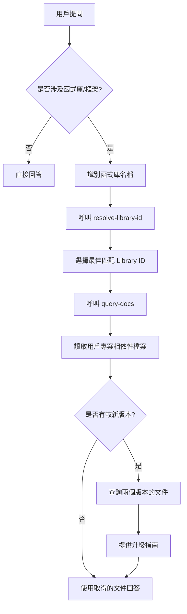

# Context7 查詢工作流程

## 概述

本文件詳細說明使用 Context7 MCP 工具回答函式庫相關問題的完整流程。

---

## 完整流程圖



---

## 步驟詳解

### 步驟 1：識別函式庫

從用戶問題中提取函式庫名稱：

| 用戶問題 | 識別結果 |
|----------|----------|
| "express best practices" | Express.js |
| "react hooks" | React |
| "how to use tailwind dark mode" | Tailwind CSS |
| "next.js routing" | Next.js |

---

### 步驟 2：解析 Library ID

呼叫 `mcp_context7_resolve-library-id`：

```javascript
mcp_context7_resolve-library-id({
  libraryName: "express",
  query: "middleware best practices"
})
```

**回傳結果範例**：
```
Library: Express.js
ID: /expressjs/express
Versions: v5.1.0, 4_21_2
Source Reputation: High
Benchmark Score: 94.2
Code Snippets: 127
```

**選擇標準**（優先順序）：
1. 名稱完全匹配
2. Source Reputation: High
3. 較高的 Benchmark Score
4. 較多的 Code Snippets

---

### 步驟 3：取得文件

呼叫 `mcp_context7_query-docs`：

```javascript
mcp_context7_query-docs({
  libraryId: "/expressjs/express",
  query: "middleware best practices"
})
```

**主題建議**：
- 使用簡潔的關鍵字：`middleware`、`routing`、`hooks`
- 避免冗長描述：~~"how to use middleware in express"~~

---

### 步驟 4：版本檢查

#### 4.1 讀取用戶相依性檔案

根據專案類型讀取對應檔案：

| 語言 | 檔案 |
|------|------|
| JavaScript/TypeScript | `package.json` |
| Python | `requirements.txt`, `pyproject.toml` |
| Ruby | `Gemfile` |
| Go | `go.mod` |
| Rust | `Cargo.toml` |

#### 4.2 比較版本

```
📦 目前版本：Express 4.21.2（來自 package.json）
🆕 最新版本：Express 5.1.0（來自 Context7）
📊 狀態：有 1 個主要版本可升級
```

#### 4.3 若有較新版本

查詢兩個版本的文件並提供：
- Breaking Changes 清單
- 遷移步驟
- 是否建議升級的評估

---

### 步驟 5：回答

使用取得的文件資訊：
- ✅ 文件中的 API 簽名
- ✅ 文件中的程式碼範例
- ✅ 文件中的最佳實踐
- ✅ 明確標註版本

---

## 範例互動

### 範例：Express Middleware 問題

**用戶**："Any best practices for express middleware?"

**流程**：

1. **識別**：Express.js
2. **resolve-library-id**：
   ```
   { libraryName: "express", query: "middleware best practices" }
   → 選擇 /expressjs/express
   ```
3. **query-docs**：
   ```
   { libraryId: "/expressjs/express", query: "middleware" }
   ```
4. **版本檢查**：
   - 讀取 `package.json` → `"express": "^4.21.2"`
   - Context7 列出：v5.1.0, 4_21_2
   - 告知：有 v5.1.0 可升級
5. **回答**：
   - 提供 Express 4.x 的 middleware 最佳實踐
   - 附上 v5.0 的重要變更說明

---

## 錯誤處理

### 若 Library ID 解析失敗

- 嘗試不同的搜尋詞（如簡稱或全名）
- 確認函式庫名稱拼寫正確
- 若仍無結果，告知用戶該函式庫可能不在 Context7 資料庫中

### 若版本資訊不可用

- 使用 `web/fetch` 查詢套件 Registry
- npm：`https://registry.npmjs.org/{package}/latest`
- PyPI：`https://pypi.org/pypi/{package}/json`
